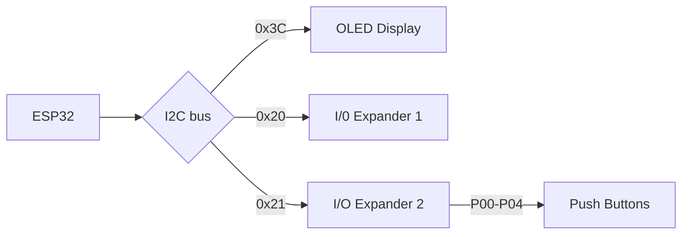

# ESP32 CD Player

Based on idea from https://github.com/daniel1111/ArduinoCdPlayer (see also https://hackaday.io/project/176545-arduino-cd-player)

# Status
Still experimenting with breadbord setup. Base board is NodeMCU ESP32 based board. Using I2C bus connected to 64x128 OLED display for now and two daughterboards containing PCA555 I2C Bus Expanders (https://www.ti.com/lit/ds/symlink/pca9555.pdf?ts=1670921675016)

Goal is to reach the same level of implementation as the Arduino project and then we can always expand with more features as the ESP32 also features WiFi and Bluetooth capabilities.

# Architecture

ESP32 is currently connected to an OLED display and two PCA555 I/O expanders. One of the I/O expanders is connected to some push buttons to allow user interaction. In future the I/O expanders are also going to be connected to the IDE bus in order to send ATAPI commands and to read TOC data back from the CD drive.

# I2C Bus Addresses
- OLED Display - 0x3C
- I/O Expander 1 - 0x20
- I/O Expander 2 - 0x21
