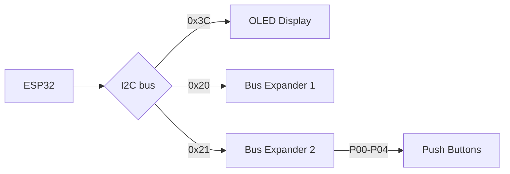

# ESP32 CD Player

Based on idea from https://github.com/daniel1111/ArduinoCdPlayer (see also https://hackaday.io/project/176545-arduino-cd-player)

# Status
Still experimenting with breadbord setup. Base board is NodeMCU ESP32 based board. Using I2C bus connected to 64x128 OLED display for now and two daughterboards containing PCA555 I2C Bus Expanders (https://www.ti.com/lit/ds/symlink/pca9555.pdf?ts=1670921675016)

# Architecture

# I2C Bus Addresses
- OLED Display - 0x3C
- I/O Expander 1 - 0x20
- I/O Expander 2 - 0x21
